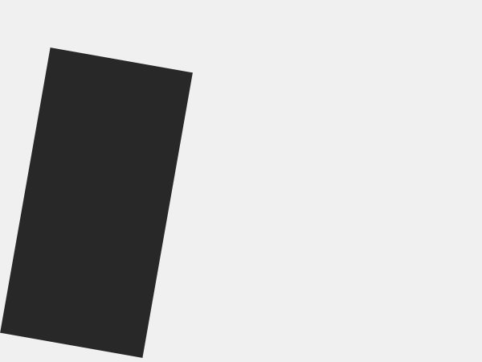

## 图形基础Figure and ground

平面设计是用形式和颜色来成功传达信息的艺术，但这并不像听起来那么容易。设计过程是一个反复尝试的过程，通常需要多次迭代才能创建一个清晰地传达您想要说的内容的设计。虽然我们倾向于认为这个过程涉及到直觉，经验丰富的设计师有一个不断扩展的视觉关系清单，帮助他们通过最终的结果。

我们进入平面设计领域的第一步是看这张清单上的第一项：图形和它的基础之间的关系。在下面的文章中，我们将使用一个矩形来演示如何在代码中操作三个简单变量-位置、大小和旋转-以创建各种不同的表达式。虽然这看起来很基本，但这些关系在大多数成功的设计中都是至关重要的因素，而且它们也恰好是引入视觉传达概念的一种很好的方式。

### 定位

大多数书面语言都有一个自然的阅读方向。在西方世界的大多数地方，文字都是以水平线排列的，我们从左到右，从上到下阅读。这告诉我们，形状的位置可以用来引导用户的眼睛通过一个设计。图形小说使用标题的定位来引导读者通过故事情节，而大多数报纸都会引用引文，在视觉上将它们与正文分开。


> 首先，因为阅读方向。


> 最后，因为阅读方向。

在这些为瑞士汽车俱乐部海报，约瑟夫穆勒-布罗克曼使用的位置(和大小)优先的某些形状。在第一张海报中，行驶中的车辆优先于跑步的孩子。这加剧了紧张局势，并使车辆明显地与儿童发生碰撞。在第二张海报中，手示意骑自行车的人是页面上的第一个形状，这正好达到了相反的效果。


> Joseph Müller-Brockmann 

我们使用`rect()`函数绘制带有P5的矩形，传递给该函数的前两个数字决定了形状在画布中的位置。如果这些数字都为零，则形状将出现在左上角，更高的值将使其进一步绘制到画布的右侧`(X)`和底部`(Y)`。这使得在代码中很容易定位形状，并且许多图形编程语言都是这样工作的。


```JavaScript
rect(0, 0, 100, 100);
rect(300, 200, 100, 100);
```

使用简单的数学方法根据画布的大小计算形状的位置，而不是随机输入数字，直到形状处于正确的位置。这将在代码中显式地定义画布和形状之间的关系，并使扩展设计变得更容易。例如，以下面的图像为例。


这种设计可以通过使用略小于矩形的`x`和`y`位置的画布的数字来实现。然而，如果我改变画布的宽度，矩形将不再出现在正确的位置。我需要更改矩形的`x`位置以反映新的画布大小。

这在下面的代码中是固定的，其中`width`和`height`变量用于动态计算矩形的位置。为了计算x位置，我们从画布的右边(`width`)开始，然后减去矩形(`100`)的大小，最后减去我们想要的画布边缘和矩形(`25`)之间的间隙。`y`位置也采用同样的公式。

```JavaScript
rect(width - 100 - 25, height - 100 - 25, 100, 100);
```

### 尺寸

通过增加重要形状的大小和减小不太重要的形状的大小，可以为设计带来清晰性。这是我们每天都会遇到的模式，从交通标志到一篇文章的标题。


> 这个广场占优势，因为它占据了大部分的画布。


> 这个广场不太占优势，因为它周围有很大的空旷空间。

1959年开始的小规模广告活动就是一个很好的例子，说明了如何利用大小来强调文本的支持性。在这一系列的杂志广告中，大众甲壳虫的形象被印在一张空空的帆布上，大小不一。


> Think Small posters 

传递给rect()函数的第三个和第四个数字定义形状的宽度和高度。与位置一样，根据画布的大小动态计算矩形的大小也是有益的。在上述示例的基础上，下面的代码显示了一个真正的动态设计，其中用于大小和间距的静态数字已被计算所取代。现在，位置和大小的矩形比例与画布自动。


```JavaScript
rect(width - (height/3) - (width/20), height - (height/3) - (width/20), height/3, height/3);
```
然而，上面的代码有一个大问题：它变得非常难读。如果你需要改变矩形的位置，你需要一段时间才能从精神上分析正在发生的事情。为了解决这个问题，在代码顶部使用变量来存储这些数字通常是很有帮助的。这使得代码更易读，这使您(和其他程序员)以后更容易更改它。下面的代码产生相同的设计，但是所有的数字现在都保存到变量中，这些变量的名称可以清楚地说明它们的目的。

```JavaScript
var size = height / 3;
var margin = width / 20;
var x = width - margin - size;
var y = height - margin - size;
rect(x, y, size, size);
```

保持您的代码组织是非常重要的，特别是当您开始设计多个单一的形状。

### 旋转

当您旋转一个形状时，它周围的空白会发生变化，这可以用来使形状看起来是活动的或在运动中。


> 由于对称空格，没有旋转的矩形看起来是静态的。


> 45°的旋转会产生更复杂的-但仍然是对称的-空格。


> 旋转27°打破了对称性，矩形出现在运动中。


旋转的形状可以在许多设计产品中找到：为儿童写的书经常使用旋转的形状来创造有趣和有趣的设计。流行杂志使用旋转网格系统使内容看起来不那么干燥，而面向狭窄读者的出版物可能会强制执行横线和垂直线，以暗示内容的质量。


> 保罗兰德(PaulRand)在儿童读物的封面上使用旋转的长方形。


> 阿迪达斯标志中的领奖台被旋转以传达速度和活力。

`rotate()`函数接受一个数字，这将是所需的弧度旋转。弧度是一个基于圆半径的角度度量的数学单位。如果你遵循一个圆的轮廓，它的半径的长度，这个角度是1弧度。根据数字的魔力，一个完整的圆因此是2π(或约6.283)弧度。对于那些对PI的复杂性不感兴趣的人，`radians()`函数可以用来将度转换为弧度。以下所有代码行都将导致旋转(大约)90度。

```JavaScript
rotate(PI/2);
rotate(1.57);
rotate(radians(90));
```

使用`rotate()`函数时，不是旋转单个形状，而是整个画布。因为所有的形状都是在画布上画的，所以它们恰好也是旋转的。结合让画布的起点移动的`translate()`，就有可能实现你想要的那种旋转。

作为一个例子，让我们假设，我们想要添加旋转到我们的矩形例子从上面。在这里，我们在绘制矩形之前添加了一个`rotate()`函数。请注意画布(由较暗的框表示)是如何围绕自己的起点旋转，而不是围绕矩形旋转。

```JavaScript
var size = height / 3;
var margin = width / 20;
var x = width - margin - size;
var y = height - margin - size;
rotate(radians(10));
rect(x, y, size, size);
```


如果我们想要旋转发生在我们的矩形左上角，我们必须做一些事情，可能会觉得有点不直观。首先，我们必须使用转换()函数将画布移动到矩形的位置。调用旋转()函数后，我们在转换的画布左上角绘制矩形。正如你所看到的，旋转现在发生在矩形周围。

```JavaScript
var size = height / 3;
var margin = width / 20;
var x = width - margin - size;
var y = height - margin - size;
translate(x, y);
rotate(radians(10));
rect(0, 0, size, size);
```


随着我们深入研究更多的布局技术，我们将进一步研究如何使用`translate()`和`rotate()`来进行更复杂的设计。

### 设计一个词

练习这些关系的一个好方法是“设计一个单词”练习。从字典中挑选一个形容词，并通过改变单个矩形的位置、大小和旋转来为其设计。这可以帮助你建立图形设计中最基本的技能之一：创建对你的内容有意义的视觉关系的能力。

下面的示例演示了“陡峭”一词的练习。你如何用一个矩形和三个变量来设计这个词呢？查找单词和变量之间的关联，您可能会注意到陡峭度和旋转是相关的：通过旋转矩形可以使矩形看起来像陡峭的山丘。通过改变大小，你可以使那座山更长，继续在画布外。通过更改矩形的位置，您可以创建非对称空格，确保用户注意到该矩形。下面的草图在代码中演示了这些步骤。


> 1.首先，我们旋转矩形，直到它看起来陡峭。


> 2.然后我们改变尺寸，使它超越画布。


> 3.将矩形从中心移开，从而引起人们对矩形的注意。

下面的例子显示了更多用于灵感的设计。记住，并不是所有的形容词都是直截了当的，所以你可能会发现自己渴望更多的形状。这是下一章的主题，所以不要担心。


> [源码](https://github.com/runemadsen/programmingdesignsystems.com/tree/master/examples/shape/figure-and-ground/flat.js)


> [源码](https://github.com/runemadsen/programmingdesignsystems.com/tree/master/examples/shape/figure-and-ground/big.js)


> [源码](https://github.com/runemadsen/programmingdesignsystems.com/tree/master/examples/shape/figure-and-ground/shy.js)

本章将展示一种贯穿本书的持续主题：我们将从平面设计理论中获取主题，了解如何在代码中实现这些想法，并通过练习实践这些概念。虽然这仅仅是进入平面设计世界的第一步，但是图形和它的基础之间的关系是很重要的。在现有设计中发现问题是很常见的，这些问题可以追溯到这种关系中，无论是用户界面没有强调一个重要的按钮，还是它的底层数据集周围有模糊的图形。记住不要急于使事情变得漂亮，并使这些概念成为您的设计过程中的关键部分。

<svg width="100%" height="3" xmlns="http://www.w3.org/2000/svg"><line x1="0" y1="1" x2="100%" y2="1" stroke-dasharray="6, 3" stroke-width="2" stroke="#29b79b"></line></svg>

### 练习

从字典中随机选择一个形容词，然后写一个草图，试图通过改变单个矩形的位置、大小和旋转来传达这个词。这样做有几个词，并要求朋友猜单词-形象组合。
