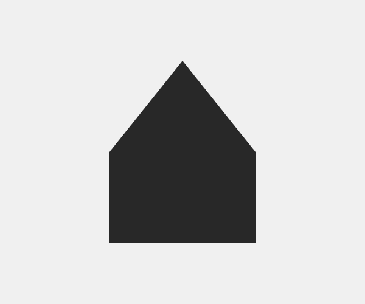
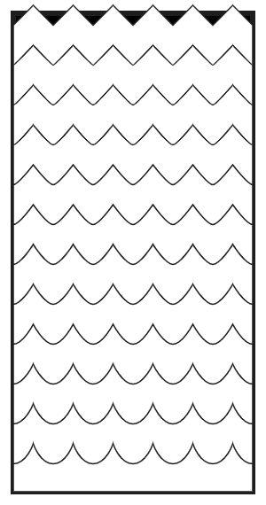

## 定制形状

虽然它是一个很好的练习，只设计[简单的形状](https://www.programmingdesignsystems.com/shape/basic-shapes/index.html)，复杂的形状提供更多的可能性。在手工设计过程中，复杂的形状往往需要很长的时间来绘制，因为设计的每一个细节都需要手工创建。尽管已经为这些任务的自动化做出了努力，但在目前的数字设计工具中，如AdobeIlluStrator或Sketch，一些设计仍然很乏味。这对于需要重复或随机化的设计来说尤其如此，就像正弦曲线的变化幅度一样。在代码中，我们能够在程序上瞬间生成非常复杂的形状，所需的代码可以非常简单。另一方面，用钢笔随机绘制的形状很难在代码中重新创建，特别是在没有解释形状轮廓的基本规则的情况下。

在接下来的章节中，我将介绍一系列的技术来按程序绘制自定义形状。但是，我们必须首先理解代码中绘制形状的基本概念，这意味着查看`beginShape()`函数，以及许多可用于定义形状轮廓的顶点函数。

### 编程定制形状

大多数图形编程语言允许您绘制自定义形状，如连接点绘图：定义一系列点(我们称之为顶点)，这些点通过线条连接形成形状的轮廓。

形状中的每个顶点决定它如何连接到它之前的顶点。如果它是一个简单的顶点，它将与一条直线相连。如果它是一个弯曲的顶点，它将与一条曲线连接。通过将最后一个顶点连接到第一个顶点，该形状可以选择性地成为一个封闭的形状。p5.js遵循同样的概念。使用`beginShape()`函数启动一个新的自定义形状，用所需的顶点函数定义形状的顶点，最后通过使用可选参数调用`endShape()`函数来连接形状中的线条以关闭该形状。在下面，我们将检查这些顶点函数。

### 直线

`vertex()`函数创建一个简单的顶点，该顶点以一条直线连接到前面的顶点。这是顶点函数中最简单的一个，所有用`beginShape()`创建的形状都必须从一个`vertex()`函数调用开始，以定义形状的起点。下面的例子说明了这一点。尝试拖动顶点以查看结果代码。


```JavaScript
beginShape();
  vertex(80, 100);
  vertex(400, 140);
  vertex(130, 310);
endShape(CLOSE)
```

下面的例子都是用简单的顶点创建的，但是使用笔画和填充来实现非常不同的设计。


> [源码](https://github.com/runemadsen/programmingdesignsystems.com/tree/master/examples/shape/custom-shapes/vertex-arrow.js)


> [源码](https://github.com/runemadsen/programmingdesignsystems.com/tree/master/examples/shape/custom-shapes/vertex-mountain.js)


> [源码](https://github.com/runemadsen/programmingdesignsystems.com/tree/master/examples/shape/custom-shapes/vertex-house.js)

### Bézier曲线 

为了创建一个用曲线连接到顶点之前的顶点，我们使用`quadraticVertex()`和`bezierVertex()`函数。它们比`vertex()`函数要复杂一些，因为它们需要几个`x`和`y`坐标来控制直线的曲线。为了理解这是如何工作的，让我们简要地看一看Bézier曲线的概念。

20世纪60年代，皮埃尔·贝塞尔(Pierre Bézier)将Bézier曲线算法推广为解决计算几何中的一个常见问题：绘制可缩放到任意尺寸的曲线。Bézier曲线算法通过引入控制点的概念，以非常优雅的方式解决了这个问题：不可见的重力点吸引线弯曲成曲线。具有单个控制点的Bézier曲线称为二次Bézier曲线，而具有两个控制点的Bézier曲线称为三次Bézier曲线。如果您曾经在AdobeIlluStrator中使用过Pen工具，那么您已经熟悉了这个概念。


> 此动画显示二次Bezier曲线是如何计算的。


> 此动画显示如何计算三次Bézier曲线。

可以使用`quadraticBezier()`函数绘制二次曲线，传递单个控制点和顶点本身的坐标。同样，您可以使用`bezierVertex()`函数绘制三次Binherier曲线，使两个控制点和顶点本身的坐标通过。这两个函数之间的唯一区别是在`bezierVertex()`函数中添加一个额外的控制点，这允许您绘制更复杂的曲线。这在下面说明，其中两种类型的曲线都用于绘制自定义形状。尝试拖动顶点和控制点以查看生成的代码。


```JavaScript
beginShape();
  vertex(80, 100);
  quadraticVertex(245, 30, 400, 140);
  bezierVertex(430, 360, 200, 170, 130, 310);
endShape(CLOSE)
```

要掌握Bézier函数需要一些练习，而且知道你需要多少个Bézier才能画出一个特定的形状，这在一开始是很困难的。控制点是不可见的，这一点并没有帮助，所以在深入研究代码之前花一些时间在上面的例子上玩会很有帮助。下面是三个示例，它们都使用Bézier函数创建自定义形状。


> [源码](https://github.com/runemadsen/programmingdesignsystems.com/tree/master/examples/shape/custom-shapes/quad-circle.js)


> [源码](https://github.com/runemadsen/programmingdesignsystems.com/tree/master/examples/shape/custom-shapes/cubic-key.js)


> [源码](https://github.com/runemadsen/programmingdesignsystems.com/tree/master/examples/shape/custom-shapes/cubic-letter.js)


### 轮廓

虽然我们可以用`vertex()`、`quadraticVertex()`和`bezierVertex()`绘制大多数形状，但这些函数不允许我们创建带有孔的形状。在P5.js中，一个洞被称为等高线，您可以使用`beginContour()`和`endContour() `函数绘制等高线形状。从本质上讲，`beginContour()`函数指示P5您正在启动一个新的形状，该形状将从您的主形状中减去。与`beginShape()`一样，您使用顶点函数来绘制轮廓，并使用`endContour()`结束轮廓。


> [源码](https://github.com/runemadsen/programmingdesignsystems.com/tree/master/examples/shape/custom-shapes/contour.js)


```JavaScript
beginShape();
  // draw rectangle here
  beginContour();
    // draw triangle here
  endContour();
endShape();
```

### “湿”和“尖”形状

您可以通过继续前几章中的“设计单词”练习来练习设计自定义形状。我对学生的作业听起来像这样：设计一个黑白两种形状的图案，代表“湿”和“尖”两个字。这是一项具有挑战性的任务，有几个原因。首先，学生必须考虑形状的轮廓如何帮助传达这些单词中的任何一个。大多数设计的结果是用弯曲的顶点来表示湿点，用简单的顶点来表示锐利，但有些设计巧妙地通过相反的方法来达到目的。此外，这些形状存在于同一画布上，这一事实鼓励学生考虑这些形状如何相互作用，以达到更戏剧性的效果。将刀状的形状直接指向光滑的形状会产生一定的张力，如果该形状指向另一个方向，这种张力就不会存在。


> Luna Chen [源码](https://github.com/runemadsen/programmingdesignsystems.com/tree/master/examples/shape/custom-shapes/wetsharp-luna.js)


> Sean McIntyre [源码](https://github.com/runemadsen/programmingdesignsystems.com/tree/master/examples/shape/custom-shapes/wetsharp-sean.js)

本章中的例子有很多在代码中精心定义的顶点，就像用鼠标绘制它们一样。这当然不是算法设计的终极承诺。为什么在用鼠标绘制速度更快的情况下，在代码中创建形状？在接下来的章节中，我们将研究一些技术，这些技术可以用来以一种更程序化的方式绘制形状。

<svg width="100%" height="3" xmlns="http://www.w3.org/2000/svg"><line x1="0" y1="1" x2="100%" y2="1" stroke-dasharray="6, 3" stroke-width="2" stroke="#29b79b"></line></svg>

### 练习

创建一个黑色和白色两种形状的设计，代表“湿”和“尖”两个词。必须使用`beginShape()`和`endShape()`函数创建形状。