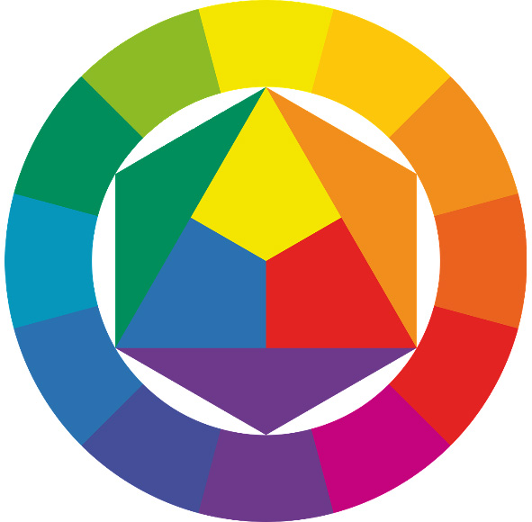
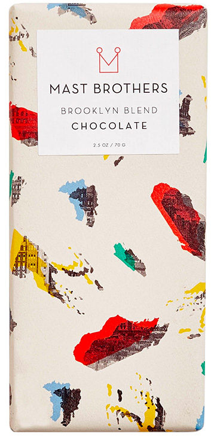
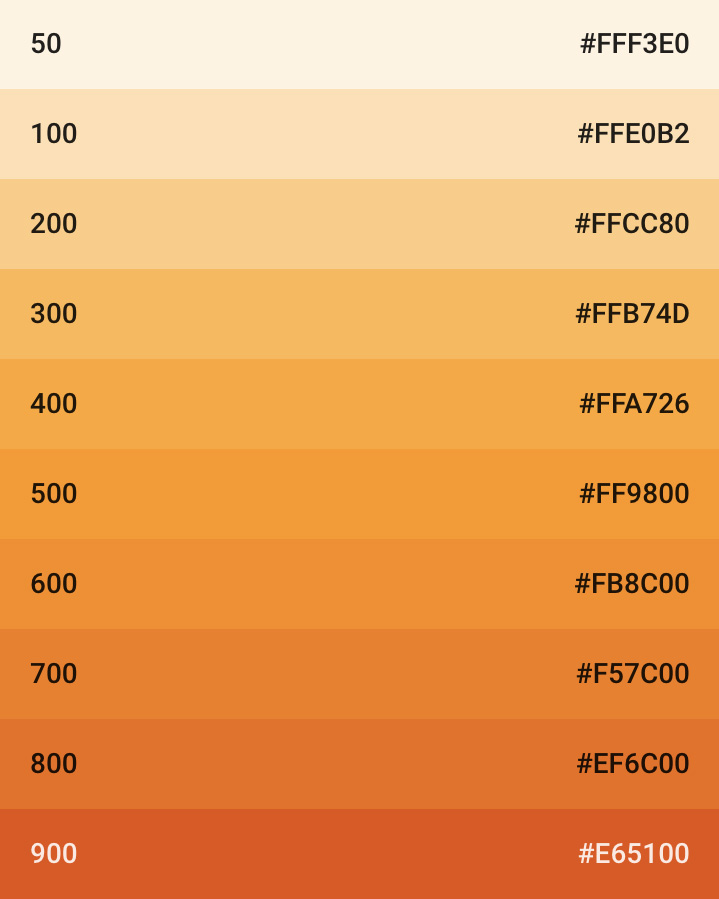

## 配色方案

色彩的有效运用对于任何设计项目的成功都是至关重要的。想象一下，一个黄色的可口可乐标志或用饱和粉色绘制的蒙娜丽莎，你可能会意识到颜色的选择对任何设计都有巨大的影响。这并不意味着颜色总是有一个明确的符号学目的。为什么停车标志被涂成红色可能是显而易见的(警告，危险，如果你忽视这一点，就会有血迹)，但大多数配色方案都很难如此直接地解释。这给我们留下了一种艺术形式，就像平面设计一般，既有客观的，也有主观的。客观地说，在白色背景上使用黄色文本是一个坏主意，因为缺乏对比会使文本难以阅读。同样，当全球约8%的男性患有红绿色盲时，不应将红色和绿色作为数据可视化的主要颜色。在处理颜色时，了解这些规则很重要，因为它们使设计人员能够创造大多数用户都易于察觉的图形。然而，要掌握色彩组合的艺术，设计师还必须知道色彩在不同的文化和语境中的运用，观察当前艺术的趋势，并在此基础上形成自己的风格。正因为如此，许多作者一直在努力创造一种教设计师如何思考色彩组合的好方法。

一种流行的方法是根据每个方案中颜色的色调之间的关系来创建颜色方案的类别。这些类别被命名为互补色（两种颜色具有相反的色调）、三色（三种颜色均匀分布在色谱仪上）和四色（四种颜色均匀分布在色谱仪上）。作者还包括一个更混合的类别集，用于不适合任何前一个类别的配色方案。这种方法之所以受欢迎，一个原因可能是教师可以通过在彩色圆圈上放置形状来可视化类别，学生可以改变这些形状的尺寸来创建不同的颜色方案。这项技术在许多关于平面设计的书中都有描述，你在设计评论中经常会遇到这些术语。


> 一种由三种均匀间隔的色调构成的三进色系


> 一种由四种均匀间隔的色调构成的四进色系

尽管这种系统化的方法似乎非常适合这本书，但我认为这种方法存在很大的问题。一个问题是，单一类别内的颜色方案没有任何连贯的视觉效果。如果稍微调整色调之间的间距，三色和四色的配色方案可能看起来非常相似，甚至完全相同。此外，在sRGB颜色空间中，纯三元组颜色方案的视觉效果与CIELUV中的相同颜色方案非常不同。最糟糕的是，这种方法倾向于忽略饱和度和明度维度，这些维度留给设计师自己去解决。下面的三种颜色方案都有相同的色调值，但是通过改变它们的饱和度和明度值来产生截然不同的视觉效果。一个忽略三分之二颜色维度的色彩理论将无法帮助设计师做出更好的决策。


> 这三种颜色方案具有相同的色调值，并且在颜色圆上绘制时看起来相同。“三元”一词无助于描述它们独特的视觉效果。

相反，本章将围绕HSL颜色模型的三个维度构建的颜色理论。通过关注颜色的色调、饱和度和亮度——以及这些维度如何相互作用——设计师可以了解代码中的变化如何在视觉上反映出来，并根据这些知识组合有趣的颜色。在下面，我们将以相反的顺序遍历这些维度，使用[HSLuv库](https://www.programmingdesignsystems.com/color/perceptually-uniform-color-spaces/index.html#hsluv)来确保代码中的更改反映了颜色的实际感知更改。

### 亮度
颜色的亮度决定了颜色中混合了多少黑色(参见[颜色模型和颜色空间](https://www.programmingdesignsystems.com/color/color-models-and-color-spaces/index.html#hsl-description))。明暗对比是一个重要的对比，即使我们可以通过控制HSL的任何维度来创建颜色之间的对比，“对比”这个术语大多数时候指的是亮度的变化。下面的例子演示了低对比度和高对比度配色方案的效果。第一个例子是柔和和轻，这是由于亮度值高，每种颜色之间的亮度差异很小。第二个例子显得更大胆，并且由于相邻颜色亮度的巨大差异而产生了显著的正面/负面影响。


> 低对比度的配色方案

```javascript
fillHsluv(0, 0, 90);
rect(0, 0, width, height);
fillHsluv(0, 0, 85);
rect(145, 95, 375, 200);
fillHsluv(0, 0, 95);
rect(85, 155, 375, 200);
```


> 高对比度的配色方案

```javascript
fillHsluv(0, 0, 0);
rect(0, 0, width, height);
fillHsluv(0, 0, 50);
rect(145, 95, 375, 200);
fillHsluv(0, 0, 100);
rect(85, 155, 375, 200);
```
Muriel Cooper是一位非常有影响力的平面设计师，她在早期的数字设计和用户界面设计方面做出了重要的工作。作为麻省理工学院媒体实验室(MIT Media Lab)的联合创始人和麻省理工学院出版社(MIT Press)的设计总监，她管理着超过500本书的制作，她的黑白设计广为人知。下面是她的两个更著名的设计，完全依赖于亮度的纬度。


> MIT Press ©. 图标


> MIT Press ©《包豪斯》一书封面设计

在处理文本时，选择合适的对比度尤其重要，因为可读性是由文本和背景之间的对比度决定的。万维网联盟(World Wide Web Consortium)在其[Web内容可触达性指南](https://www.w3.org/TR/UNDERSTANDING-WCAG20/visual-audio-contrast-contrast.html)中建议，正文文本的对比度应至少为4.5:1(或小于0.222)，并且他们提供了以下公式来计算两个亮度值的对比度。

```javasciprt
var contrastRatio = (l1 + 0.05) / (l2 + 0.05);
```

这个公式要求在相对亮度中提供两个亮度值，即CIEXYZ颜色空间中的Y维。为了计算HSLuv颜色的W3C对比度，我们首先需要将亮度值转换为CIEXYZ颜色空间，然后使用上面的公式计算对比度。下面的代码示例演示了这一点，其中`contrastRatio()`函数可以根据两个HSLuv亮度值计算对比度。

```javascript
function lightnessToLuminance(l) {
  if (l <= 8) {
    return 1.0 * l / 903.2962962;
  } else {
    return 1.0 * Math.pow((l + 16) / 116, 3);
  }
}

function contrastRatio(l1, l2) {
  l1 = lightnessToLuminance(l1);
  l2 = lightnessToLuminance(l2);
  return (l1 + 0.05) / (l2 + 0.05);
}

function setup() {
  console.log(contrastRatio(40, 70)); // BAD! 0.35521707859730733
  console.log(contrastRatio(40, 90)); // GOOD! 0.19988073069469958
}
```

亮度在任何配色方案中都扮演着重要的角色，无论是在可触达性还是美观方面。和本书前面的练习一样，建议有抱负的设计师只练习黑白设计，以学习如何在他们的设计中建立适当的对比。如果一个设计看起来很杂乱，“它在黑色和白色中是什么样子的”是一个很好的问题，因为它可以揭示出在设计中形状之间缺乏对比。


### 饱和度
颜色的饱和度控制颜色从灰度到全色的纯度(参见颜色模型和颜色空间)。您可以使用这个维度创建从非常柔和到非常明亮的颜色组合。下面的两个例子使用相同的明度和色调值，只是饱和度不同。


> 减饱和度色彩方案

```javascript
fillHsluv(40, 30, 65);
rect(0, 0, width, height);
fillHsluv(10, 40, 40);
rect(145, 95, 375, 200);
fillHsluv(75, 50, 85);
rect(85, 155, 375, 200);
```


> 饱和度方案

```javascript
fillHsluv(40, 100, 65);
rect(0, 0, width, height);
fillHsluv(10, 100, 40);
rect(145, 95, 375, 200);
fillHsluv(75, 100, 85);
rect(85, 155, 375, 200);
```

在用户界面设计中，饱和度常被用来区分未激活和激活界面组件。苹果的iOS操作系统对一般的界面元素采用去饱和度的配色方案，但对于关键动作，如激活的切换按钮和应用程序通知，则使用完全饱和的颜色。这使得用户能够快速了解界面的状态，并注意到新的应用程序事件何时发生，就像旧交换机上的LED灯亮了一样。


> iOS 11控制中心使用单色色彩空间，但对于激活的按钮则使用完全饱和的颜色。

当处理色彩饱和度时，一个很好的类比是，许多国家在其城市中有着不同粉刷房屋的方式。这些颜料的饱和度可以有很大的变化，虽然并没有任何内在的含义，但它们确实说明了时间、地点和人。想象一下，日本的一个小村庄，它的色彩柔和而不饱和，然后把它与墨西哥这样的地方进行比较，那里的房子都漆成非常纯净、饱和的颜色。这些颜色反映了它们周围的文化，你应该以同样的方式来考虑你的内容:它需要活泼的颜色还是柔和的还是现代主义的方案?颜色的饱和度是关键。


> 不饱和色彩的日本城镇 照片来源于[663h](https://ja.wikipedia.org/wiki/%E5%88%A9%E7%94%A8%E8%80%85:663highland)


> 墨西哥的房子漆上了饱和的颜色

### 色调
色调维度决定实际要显示的颜色，由颜色名称表示(如红色、绿色和蓝色，[请参阅颜色模型和颜色空间](https://www.programmingdesignsystems.com/color/color-models-and-color-spaces/index.html#hsl-description))。如前一章所述，色调组合产生调和效果的理论并不一致。尽管许多人都试过，但要对这样一件事来作出概括性的理论是不可能的。然而，从世上现存色调组合中可以得出一些有益的结论。

在自然界中，我们经常能在光谱的红绿部分看到细微的色相差异。在春天，树木和植物将呈现几乎单一的明亮绿色，但随着进入秋季，这些颜色将轻微地分散成许多相近的颜色，如绿色、黄色和红色。你会经常发现在设计产品中这样的色调组合能唤起宁静或和平的感觉，如瑜伽工作室，有机食品和婚礼请柬。另一种类似的配色方案可以在来自外太空的照片中找到，在那里，光谱中较亮的蓝色/绿色部分营造了一种几乎是外星的效果。这些颜色通常用于技术或软件产品中，这些产品想要看起来呈流线型，且故意这样做。苹果(Apple)和微软(Microsoft)的门店看起来就像宇宙飞船里的空间，这并非巧合:它们的设计初衷是让顾客觉得自己进入了一个最先进的科学实验室，因为这能让他们接受更高的价格。以下两种类型的配色方案，在光谱上颜色彼此接近，但视觉效果却截然不同。


```javascript
fillHsluv(75, 95, 70);
rect(0, 0, width, height);
fillHsluv(35, 90, 40);
rect(145, 95, 375, 200);
fillHsluv(55, 100, 80);
rect(85, 155, 375, 200);
```


```javascript
fillHsluv(270, 65, 15);
rect(0, 0, width, height);
fillHsluv(295, 70, 55);
rect(145, 95, 375, 200);
fillHsluv(278, 100, 73);
rect(85, 155, 375, 200);
```

当色调之间的距离增加时，会产生更深远的影响。然而，这种说法可能具有欺骗性。虽然彼此接近的颜色有一个很好的相似效果，但色环相对边上的颜色不一定具有最明显的色调对比度。两种色调的视觉效果不能用一个简单的公式来计算，更多的是由实际选择的色调、如何在设计中使用它们以及它们的饱和度和亮度值决定的。然而，在设计过程中，像考虑其他任何关系一样，考虑色调的间距也是很重要的:我的内容是否需要平面的、单色的颜色，或者多种颜色?


> 弱色调对比


> 中等色调对比


> 强色调对比

我们讨论色相维度的时不得不提及各类的色盲，色盲使许多人难以区分特定的色调。最常见的色盲是红绿色盲，这使得人们很难区分红色和绿色。如果绿色的视网膜锥严重受损，这部分人只能看到蓝色。一种较少见的色盲类型是蓝黄色，其中蓝色、黄色和绿色是无法区分的。此外，在最罕见的情况下，有些人只有单色视力。全球高达8%的男性和0.5%的女性患有色盲。这意味着，色彩方案，特别是教学使用的方案，不应该仅仅依赖于色调来构造色彩对比。应该始终把亮度考虑在内，因为几乎所有视力正常的人都具有通过对比来区分颜色的能力。


> 正常色彩视觉


> 轻度红绿色盲


> 重度红绿色盲

### 色彩方案示例

色彩的这三个维度衍生无穷色彩组合实验。虽然一些色彩方案仅由在一个维度上变化的颜色组成（如一些单色设计），但大多数色彩方案将色调、饱和度和亮度的变化结合起来以实现颜色的调色板。总部位于布鲁克林的巧克力生产商马斯特兄弟（mast brothers）以其丰富多彩的包装设计而闻名，彩色图案被用来表示巧克力的风味轮廓。这些模式提供了一个很好的研究案例，说明可以操纵颜色的三个纬度来构建不同的表达。


> 烟


> 薄荷


> 布鲁克林的混合

第一个图案是用烟熏豆做成的黑巧克力，设计师选用了一种强对比度的单色方案，波浪的形状暗示烟雾漂浮在空气中。注意这些颜色本身看起来并不“自然”，而是用来传达产品的味道。第二个图案是带薄荷叶的黑巧克力，其特点是颜色从深绿色到亮黄色的渐变，并在50年代形成固化的饱和度。渐变提供了一种有趣的方式来呈现这两种不同的口味，尽管它们有不同的特点，但却能很好地融合在一起。最后的图案在较浅的背景上采用了四种颜色方案，其中具有较大色调对比的饱和颜色用于为类似于颜料上色的形状。一个有趣和创造性的布鲁克林区设计。

### 程序色彩方案

到目前为止，我们已经人工硬编码了颜色值来构建配色方案。我们为了真正利用代码来生成这些设计，应该研究如何程序化地生成这些颜色。也就是说，使用循环代码中来创建多种颜色。这意味着要关注```color()```函数以及如何使用循环来动态创建color对象。

js中的color()函数可用于创建可复用的color对象，该对象可在fill()和stroke()函数中重复使用。这意味着，与其让相同的颜色值分散在代码中，不如在代码的顶部为一个变量分配一个颜色对象，并在需要使用颜色时引用这个变量。参考以下代码，其中多次使用相同的红色。

```javascript
fill(225, 35, 35);
rect(50, 50, 200, 180);

fill(40, 185, 155);
rect(200, 100, 200, 180);

Second use of red

fill(225, 35, 35);
rect(350, 150, 200, 180);
```


这个例子可以使用color()函数来重新实现，颜色值在代码中只出现一次。

```javascript
var red = color(225, 35, 35);

Use it here

fill(red);
rect(50, 50, 200, 180);

fill(40, 185, 155);
rect(200, 100, 200, 180);

Use it here

fill(red);
rect(350, 150, 200, 180);
```


要使用color()函数和HSLuv值，我们需要创建一个小函数，在创建color对象之前执行HSLuv到RGB的转换。除了使用color()函数外，这个函数与上一章中的fillHSluv()和strokeHsluv()函数相同。请记住，你必须包含HSLuv JavaScript文件才能实现这一点。

```javascript
function colorHsluv(h, s, l) {
  var rgb = hsluv.hsluvToRgb([h, s, l]);
  return color(rgb[0] * 255, rgb[1] * 255, rgb[2] * 255);
}

var red = colorHsluv(225, 35, 35);
fill(red);
```

现在，如果我们想在设计中使用多种颜色呢?在上面的代码中添加更多的变量是有意义的。虽然这对于少数几种颜色来说是完全可以的，但是对于大量的颜色来说就没有意义了。在这个场景中，更明智的做法是使用一个数组，允许在不引入新变量的情况下添加和删除颜色。下面的代码将三个颜色存储在一个数组中，并使用它们来绘制一个配色方案。

```javascript
var colors = [
  colorHsluv(40, 100, 65),
  colorHsluv(10, 100, 40),
  colorHsluv(75, 100, 85)
];

fill(colors[0]);
rect(0, 0, width, height);
fill(colors[1]);
rect(145, 95, 375, 200);
fill(colors[2]);
rect(85, 155, 375, 200);
```


最后，我们可以使用循环来动态创建color对象。为此，我们使用一个空数组，并在每次循环迭代时将一个新的color对象推入数组。这个例子使用```random()```函数来确保每次循环运行时的颜色是不同的。

```javascript
var colors = [];

for(var i = 0; i < 3; i++) {
Push new color with random hue, saturation, and lightness into array every time

  colors.push(
    colorHsluv(
      random(360),
      random(100),
      random(100)
    )
  )
}

fill(colors[0]);
rect(0, 0, width, height);
fill(colors[1]);
rect(145, 95, 375, 200);
fill(colors[2]);
rect(85, 155, 375, 200);
```


有了这些概念，我们就可以按程序生成配色方案了。一种策略(可能也是最简单的策略)，就是持续使用```random()```，通过更改```random()```函数的传参来创建不同类型的配色方案。


```javascript
var colors = [];
for(var i = 0; i < 3; i++) {
  colors.push(
    colorHsluv(240, 20, random(100))
  )
}

fill(colors[0]);
rect(0, 0, width, height);
fill(colors[1]);
rect(145, 95, 375, 200);
fill(colors[2]);
rect(85, 155, 375, 200);
```


```javascript
var colors = [];
for(var i = 0; i < 3; i++) {
  colors.push(
    colorHsluv(random(360), 90, 50)
  )
}

fill(colors[0]);
rect(0, 0, width, height);
fill(colors[1]);
rect(145, 95, 375, 200);
fill(colors[2]);
rect(85, 155, 375, 200);
```

然而，```random()```函数很可能会产生相近的数字，从而得到非常相似的颜色。一个更强大的策略是使用循环的递增i变量来计算传递给```color()```函数的值。这种技术与[过程形状](https://www.programmingdesignsystems.com/shape/procedural-shapes/index.html#for-loop)一章中演示的技术相同，但这次我们将它用于颜色值，而不是x和y位置。下面的示例使用i创建一个亮度值为20、50和80的单色配色方案，同时保持色调和饱和度不变。


```javascript
var colors = [];
for(var i = 0; i < 3; i++) {
  colors.push(
    colorHsluv(240, 100, 20 + (i * 30))
  )
}

fill(colors[0]);
rect(0, 0, width, height);
fill(colors[1]);
rect(145, 95, 375, 200);
fill(colors[2]);
```


下面，在所有维度中使用相同的技术。留意色调值是如何递增的，而饱和度和亮度值是如何递减的。最后的结果是一个配色方案，其中的背景是光和饱和，但前面的颜色是较暗和较少饱和。

```javascript
var colors = [];
for(var i = 0; i < 3; i++) {
  colors.push(
    colorHsluv(
      100 + (i * 80),
      100 - (i * 20),
      90 - (i * 30)
    )
  )
}

fill(colors[0]);
rect(0, 0, width, height);
fill(colors[1]);
rect(145, 95, 375, 200);
fill(colors[2]);
rect(85, 155, 375, 200);
```


通过添加一些变量来存储初始颜色值以及它们在循环中变更的值，这段代码可以变得更加令人惊喜。我们可以在每次运行代码时使用random()函数选择不同的值，而不是硬编码这些变量。下面运行三次相同的代码，从相同的算法产生三种不同的配色方案。通过更改传递给```random()```函数的值，这段代码可以产生许多不同的输出。


```javascript
var startHue = random(0, 360);
var startSat = random(40, 100);
var startLig = random(0, 60);

How much should each color change?

var changeHue = random(10, 120);
var changeSat = random(15, 40);
var changeLig = random(15, 40)

var colors = [];
for(var i = 0; i < 3; i++) {
  colors.push(
    colorHsluv(
Use these values in the same algorithm as before

      startHue + (i * changeHue),
      startSat + (i * changeSat),
      startLig + (i * changeLig)
    )
  )
}

fill(colors[0]);
rect(0, 0, width, height);
fill(colors[1]);
rect(145, 95, 375, 200);
fill(colors[2]);
rect(85, 155, 375, 200);
```

在结束本章之前，我们不能不讨论程序颜色生成的另一种有用技术```lerp()```函数——它可以用来计算两种颜色的转换。```lerp()```函数与颜色无关,因为它可以用于计算两个数字之间的任意数字。函数期望——除了两个范围的数字——一个插值量来计算结果数。插值量0将返回第一个数字,0.5将返回两个数字中间的数字,1将返回第二个数字。

```javascript
lerp(0, 100, 0.2) // => 20
lerp(0, 50, 0.5) // => 25
lerp(0, 360, 0.8) // => 288
```

由于颜色由三个数值组成，我们可以用这个函数三次来计算两种颜色之间的任何颜色。需要注意的是，P5.js有一个```colorLerp()```函数，它仅用一行代码来计算。但是，它只能在内置的颜色模式下工作，而不能在HSLuv库中工作。下面的例子中，颜色介于深饱和的绿色和较淡的去饱和的蓝色之间。

```javascript
var h = lerp(120, 240, 0.5);
Find saturation between 95 and 40

var s = lerp(96, 40, 0.5);
Find lightness between 31 and 74

var l = lerp(31, 74, 0.5);
var midwayColor = colorHsluv(h, s, l);
```

当与循环结合使用时，这种技术变得更加强大，其中插值量可以通过i除以其最大可能值来计算。因为这个计算是用递增的i值反复执行的，它将产生0到1之间的插值量，其步骤数等于循环运行的次数。当绘制两种颜色之间的渐变时，这种方法非常有用，如下面的示例，其中重新创建了来自谷歌的[Material Design](https://material.io/guidelines/style/color.html)文档的颜色样本。




> 来自Material Design©的颜色样本 在循环中使用lerp()函数重新创建的。

```javascript
var boxh = height / 10;
for(var i = 0; i < 10; i++) {
  var h = lerp(64, 22, i / 9);
  var s = lerp(86, 90, i / 9);
  var l = lerp(96, 56, i / 9);
  fillHsluv(h, s, l);
  rect(0, i * boxh, width, boxh);
}
```

本章介绍了帮助设计师通过HSL颜色模型的色调、饱和度和亮度维度来探索颜色光谱的技术。使用这些技术,设计师可以不再使用颜色选择器的2D纯色,并通过专注于三维空间中颜色之间的关系来接近颜色组合。这些技术是否被用来快速测试不同的颜色组合,或者直接构建到数字设计产品,对于想要将设计视为系统艺术的设计师来说，它们都是另一个重要的工具。


### 练习

为你最喜欢的书设计一个简单的书皮。设计应该使用基本或自定义的形状，但没有排版。一旦你的设计传达了故事情节中的一些东西，考虑需要哪种颜色方案来支撑你的设计。请记住，科幻惊悚片可能比浪漫小说需要更多不同的颜色。然后，使用本章介绍的技术为设计里的形状上色。与其对颜色进行硬编码，不如尝试做出每次运行时颜色方案都不相同的设计。挑战做出一个具有一致视觉风格的动态配色方案。