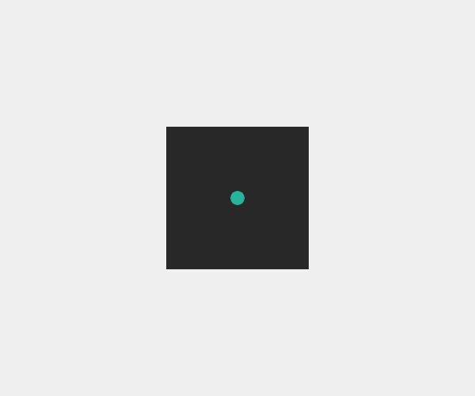
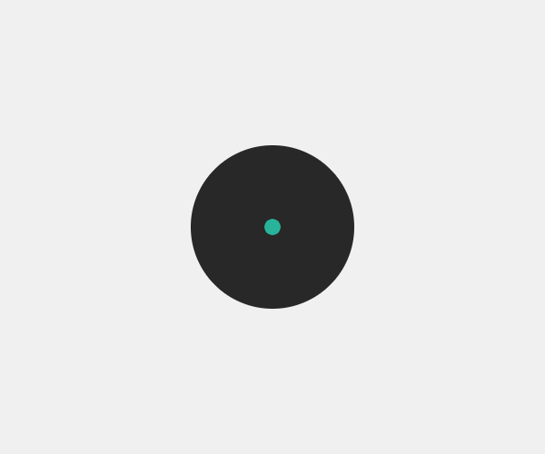
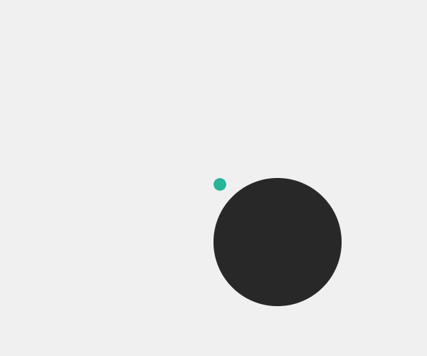
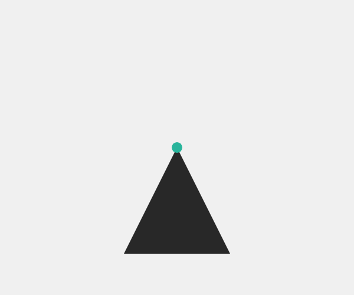
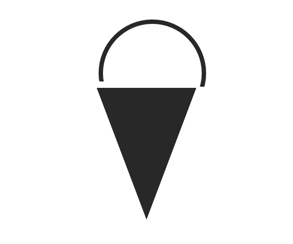
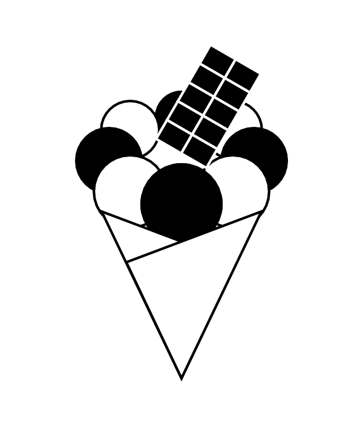

## 基本形状

只要我们有绘画的能力，人类就会利用形状来进行视觉交流。虽然形状不是文字，因此没有客观的语义意义，但我们对如何将形状的特征转化为意义有了一个自然的理解：30，000多年前创造的洞穴画可以在今天不需要翻译的情况下被欣赏。

在本章中，我们将查看三种基本形状：矩形、椭圆和三角形。首先，我们将分析每个形状的特点，然后说明如何在设计过程中使用这些基本形状。


### 矩形

该矩形是一个对称的，实心的形状与平行线。由于它的性质并不多，它已成为文明本身的象征。我们用矩形网格建造城市，用砖块建造房屋，我们的内部也是矩形的：门、架子和窗户。

在整个艺术史上，长方形一直被用来为艺术家设置约束。我们使用矩形画布和网格系统进一步将这个画布划分成更小的模块。在这个数字时代，我们使用矩形屏幕，并以一个方形作为最小的视觉分母：像素。


> Microsoft徽标中的方块成为窗口、标志和像素化屏幕的符号。


> 这位8位音乐家Nullleep的标志在像素化字体的顶部有一个矩形，作为反独裁主义和早期计算机艺术的参考。

在几何学中，矩形由四个点组成，连接成一个封闭的形状，内角为90度。但是，P5中的rect()函数允许我们通过声明左上角(我们将称为起始点)的位置以及矩形的大小来绘制矩形。如下所示，矩形模式()函数可用于将矩形的起始点更改为形状的中心。这在某些情况下是有帮助的，例如，如果您想在画布的中心画一个矩形，而不需要从它的位置减去该矩形的一半大小。


```JavaScript
var size = width * 0.3;
rect(width/2, height/2, size, size);
```



```JavaScript
rectMode(CENTER);
var size = width * 0.3;
rect(width/2, height/2, size, size);
```

### 椭圆

椭圆是一个光滑的形状，在自然界的许多地方发现，在行星的形状，雨滴，和大多数动物的眼睛。由于没有明显的方向感，椭圆有一些中性的东西，人类倾向于聚集在椭圆中来实现统一：我们在圆圈中跳舞，并在椭圆的安排中设计大多数议会的座位。


> 皮埃尔·德·顾拜旦(Pierre De Coubertin)的奥运会象征由五个相连的椭圆组成，颜色取自1912年奥运会各国国旗上的颜色。


> 保罗兰德的ABC标志的特点是一个简单的椭圆与椭圆字体。

在几何学中，椭圆是一种封闭的形状，你可以通过在地面上锤击两根钉子，用一根绳子将它们连接起来，然后用一支笔通过绳子画出一个圆形。虽然椭圆的轮廓在人眼看来是光滑的，但计算机实际上把椭圆画成一系列短的、直的、连接的线。与rect()不同，椭圆()函数将绘制一个椭圆，其起始点位于形状的中心。如下所示，省略模式()函数可用于将原点更改为左上角。考虑到椭圆的性质，这意味着起源点位于形状轮廓之外。



```JavaScript
var size = width * 0.3;
ellipse(width/2, height/2, size, size);
```



```JavaScript
ellipseMode(CORNER);
var size = width * 0.3;
ellipse(width/2, height/2, size, size);
```

### 三角形

三角形是一个不对称的形状，由于其方向性，在基本形状中是独一无二的。它通常被认为是男性气质(▲)和女性气质(▼)的象征，它因其美学品质而被广泛应用于平面设计中。我们最重要的文物之一，吉萨大金字塔，也是著名的三角形描绘，指向假定的天空旋转中心，埃及人认为这是神圣的品质。


> 三角洲标志是由四个较小的三角形组成的三角形。标志指希腊三角形字母同名，三角形的方向性用来表示速度和飞行。

在几何学中，三角形是由三点组成的封闭形状。三角形的内角之和总是180度(或PI弧度)。这个三角形在许多数学突破中发挥了核心作用，包括欧几里得几何学、三角学以及三维计算机图形学。与rect()和省略()函数不同，这两个函数都期望形状的起始点有一个位置，三角形()函数需要三角形所有三个角的坐标。这也意味着没有所谓的triangleMode()函数。您需要执行自己的计算来在特定的起始点周围绘制一个三角形，这在下面的示例中得到了演示。



```JavaScript
var size = width * 0.15;
translate(width/2, height/2);
triangle(0, 0, size, size*2, -size, size*2);
```


```JavaScript
var size = width * 0.15;
translate(width/2, height/2);
triangle(0, -size, size, size, -size, size);
```

### 冰淇淋筒

我给我的学生做了以下(有点愚蠢)的练习：设计一个黑白冰淇淋筒，代码中每个基本形状函数只出现一次。这些严格的约束迫使学生专注于形状的特征，以及如何定位、大小和旋转这些形状以实现有效的设计。

这个练习的最重要的方面显然是创造一个设计，大多数用户会认为是一个冰淇淋筒。一个设计是否完成这是一个相当客观的任务。在下面的两种设计中，很明显，第一种设计成功地解决了分配问题，而后者却没有。这也是很容易分析的原因：虽然形状几乎相同的两种设计，后者没有建立适当的视觉关系。


第二个(和更主观的)方面与设计风格有关。在一定程度上，不同的风格适合不同的场景。如果你被要求为一个网站创建一个图标，抽象的风格可能会更好，因为简单的设计在小尺寸的情况下工作得更好。另一方面，如果你在为一本儿童读物做一个插图，一些更大胆、更有趣的东西可能会更适合你。风格可以用来为特定的功能服务，也可以纯粹用于美学(毕竟，这也可以是一种功能)。最后，设计风格是设计师主观喜好明显的地方。

在这个练习中，我经常鼓励我的学生练习不同风格的设计，因为它进一步发展了他们的视觉语言。样式创建过程中的一个重要因素是`fill()`、`stroke()`和`strokeWeight()`函数的使用。如下所示，这些功能可以极大地改变设计风格。


> 同样比例的形状和相同的笔画导致了抽象的设计。


> 更厚的笔画和填充使一个更有趣的设计。

这个练习还鼓励学生在用代码实现他们的设计时要有系统地思考。这三个基本的形状函数只能在代码中出现一次，因此学生需要使用循环来绘制更复杂的设计。下面的三个例子都是我以前的学生做的，他们在这里展示了上面提到的所有事情的成功例子：它们都客观地解决了用基本形状构造冰淇淋锥的任务。它们都通过巧妙地结合基本形状功能和以下关系来实现不同的风格：位置、大小、旋转、填充、直线和行程重量。最后，他们都使用重复(我们将致力于这本书的整个部分)在画布上画三个以上的形状。


> 由Luisa Pereira设计 [源码](https://github.com/runemadsen/programmingdesignsystems.com/tree/master/examples/shape/basic-shapes/cone-luisa.js)


> 由Shir David设计 [源码](https://github.com/runemadsen/programmingdesignsystems.com/tree/master/examples/shape/basic-shapes/cone-shir.js)
    

> 由Tan Ma设计 [源码](https://github.com/runemadsen/programmingdesignsystems.com/tree/master/examples/shape/basic-shapes/cone-tan.js)

当你用基本形状设计的时候，是时候在你的设计过程中引入更复杂的形状了。我们将在下一章中通过研究计算几何中的一些基本概念来实现这一点，然后再进行过程形状生成。

<svg width="100%" height="3" xmlns="http://www.w3.org/2000/svg"><line x1="0" y1="1" x2="100%" y2="1" stroke-dasharray="6, 3" stroke-width="2" stroke="#29b79b"></line></svg>

### 练习

设计一个黑白冰淇淋锥，代码中每个基本形状函数只出现一次。
