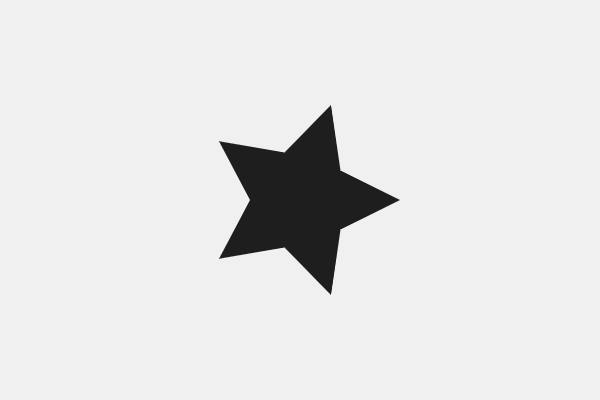
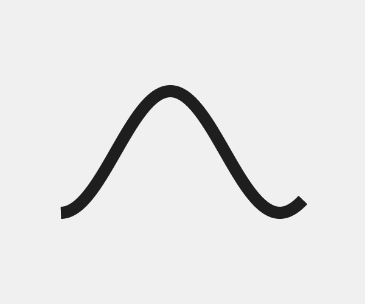

## 程序形状

我们定制形状示例的代码迄今为止相当乏味。在顶点函数调用行之后，我们通过键入直线来手动创建形状，并且此策略不适用于更复杂的形状。此外，考虑到这本书的标题，这种方法似乎有点反气候。现在我们了解`beginShape()`的基础知识，让我们首先了解如何使用FOR循环程序绘制自定义形状，以及`sin()`和`cos()`函数。

### 正余弦

这些年来，我看到许多学生与正弦和余弦搏斗。这很容易理解为什么：这些词似乎相当可怕和抽象，特别是如果你认为自己不擅长数学。然而，这既是不幸的，也是不必要的。不幸的是，因为这两个功能是大多数编程设计的基本部分，对它们的良好理解将使您能够解决许多视觉问题。没有必要，因为它们并不难学。即使您不了解本章中的所有内容，也可以从记住两行几乎相同的代码开始。

正弦和余弦允许我们找到椭圆轮廓上的任何位置。他们通过将一个角度转换为`x`位置(余弦)或`y`位置(正弦)来实现这一点。然后，这些值可以乘以实际圆周的半径来扩展它们。虽然严格来说不需要理解这些函数是如何内部工作的，但这里有一种方法可以可视化正在发生的事情：设想一个将圆心连接到轮廓点的右侧三角形。正弦函数是快速求出三角形的左侧(低音)与右侧(相对)的比值的一种方法。余弦函数同样是低音和三角形底部(邻接)之间的比率。


在P5中，这些函数称为`sin()`和`cos()`。如上所述，它们接受一个参数-一个弧度角-并返回一个介于`-1`和`1`之间的值，表示在一个小圆上的`x`或`y`位置。下面的两行演示了如何得到这些值，并将它们乘以实际圆的半径。记住这两句话，因为它们非常重要。

```JavaScript
var x = cos(RADIANS) * RADIUS;
var y = sin(RADIANS) * RADIUS;
```

要将此置于上下文中，以下是一个示例，在此示例中，我们使用相同的代码沿着较大的圆的轮廓绘制小的圆330度。


```JavaScript
translate(width/2, height/2);

noFill();
var radius = width * 0.3;
ellipse(0, 0, radius*2, radius*2);

fill(30);
var x = cos(radians(330)) * radius;
var y = sin(radians(330)) * radius;
ellipse(x, y, 20, 20);
```

如果考虑所有基本形状以及许多复杂形状，它们的特点是具有围绕中心点移动的非重叠轮廓。某些形状（如三角形）仅有几个顶点，而其他形状（如椭圆）具有多个顶点。`sin()`和`cos()`函数提供了一种以程序方式绘制这些类型的形状。

### for循环

尽管我们将把本书的整个部分用于重复，但让我们简要介绍一下`for`循环的基本功能。`for`循环允许我们在一行中多次执行代码，方法是递增(或递减)一个变量(通常称为`i`)，直到表达式不再为真，循环停止。在下面的示例中，我们用数字`0`初始化一个变量，在变量小于`10`的情况下迭代，并在每次迭代之间增加一个变量。结果是一个循环，用我们的变量从0增加到9，循环10次，在屏幕上绘制10个矩形。


```JavaScript
for(var i = 0; i < 10; i++) {
  rect(0, 0, 100, 100);
}
```

不幸的是，所有这些矩形都有相同的位置和大小，因为我们一次又一次地将相同的静态数字传递给`rect()`函数。这就是`i`要发挥的地方：因为它在循环的每一次迭代之间都会发生变化，所以可以用来在每个矩形之间创建差异。下面的示例使用`i`来定位x轴上的十个矩形，每一个像素相距1像素。


```JavaScript
for(var i = 0; i < 10; i++) {
  rect(i, 0, 100, 100);
}
```

虽然这可能并不立即清楚，但当绘制程序设计时，这是一项重要的技术。因为`i`在每次迭代之间递增一个，所以它可以作为标量来分布在画布上的形状。例如，如果我们想要定位彼此相邻的矩形，则可以将`i`乘以大于矩形宽度的数。


```JavaScript
for(var i = 0; i < 10; i++) {
  rect(i * 105, 0, 100, 100);
}
```

我们可以使用同样的技术绘制自定义形状。不是在循环中绘制各个形状，而是使用for循环程序在`beginShape()`和`endShape()`函数调用之间添加顶点。在下面的示例中，我们使用此技术绘制画布中心的十个随机顶点。


```JavaScript
translate(width/2, height/2);
beginShape();
for(var i = 0; i < 10; i++) {
  var x = random(-100, 100);
  var y = random(-100, 100);
  vertex(x, y);
}
endShape();
```

结果当然是一个过程形状，但是使用`random()`并不能让我们对顶点的放置有很大的控制：这个形状只是一堆随机交叉的线。最后一步是将我们的两种技术放在一起，并在`for`循环中使用`sin()`和`cos()`生成形状。

### 把它放在一起

从上面的随机形状代码开始，让我们用沿椭圆轮廓顺序放置的顶点替换随机顶点。我们使用前面记忆的两行线来实现这一点，但是没有将相同的角度传递给sin()和cos()，而是在每次迭代中通过将i乘以我们想要的顶点之间的角度来计算不同的角度。结果是一个形状，10个顶点均匀地分布在画布的中心。


```JavaScript
translate(width/2, height/2);
beginShape();
for(var i = 0; i < 10; i++) {
  var x = cos(radians(i * 36)) * 100;
  var y = sin(radians(i * 36)) * 100;
  vertex(x, y);
}
endShape();
```

通过改变迭代次数和顶点之间的间距，您可以绘制所有基本形状。下面的代码在草图的顶部添加了几个变量，根据顶点的数量自动计算间距。更改numVertices变量，将出现另一个形状。


```JavaScript
var numVertices = 3; // or 4 or 30
var spacing = 360 / numVertices;
translate(width/2, height/2);
beginShape();
for(var i = 0; i < 10; i++) {
  var x = cos(radians(i * spacing)) * 100;
  var y = sin(radians(i * spacing)) * 100;
  vertex(x, y);
}
endShape();
```

你可能会说，“太好了，我们重新发明了基本的形状功能”。实际上，这种技术可以让我们画出更复杂的形状。让我们看几个例子，它们都使用相同的sin()和cos()公式来绘制不同类型的形状。我们从下面的圆圈开始，每个顶点的半径都是随机的，这样看起来就像手工画的一样。


```JavaScript
translate(width/2, height/2);

beginShape();
for(var i = 0; i < 100; i++) {
  var radius = 100 + random(5); // 改变每个顶点的半径
  var x = cos(radians(i * 3.6)) * radius;
  var y = sin(radians(i * 3.6)) * radius;
  vertex(x, y);
}
endShape();
```

下面的恒星是通过在每个顶点的低半径和高半径之间交替产生的。通过使用不同的数字或更多的顶点，或者使用旋转（）来改变恒星的方向，很容易调整恒星的风格。



```JavaScript
translate(width/2, height/2);
var radius = 100; // 将初始半径设置为100
beginShape();
for(var i = 0; i < 10; i++) { // 使用cos/sin公式中的半径。
  var x = cos(radians(i * 36)) * radius;
  var y = sin(radians(i * 36)) * radius;
  vertex(x, y);
  if(radius == 100) { // 改变下一个顶点的半径
    radius = 50;
  } else {
    radius = 100;
  }
}
endShape();
```

这里是一个用二次顶点()创建的花，其中所有的顶点和控制点都使用`sin()`和`cos()`定位。通过对控制点使用更大的半径(上面星图的反例)，曲线就会向外延伸。使用Bézier曲线时，请记住使用`vertex()`函数调用开始形状。我们通过检查循环中`i`的值来做到这一点。


```JavaScript
var numVertices = 7; // 自动计算间距
var spacing = 360 / numVertices;

beginShape();

for(var i = 0; i < numVertices+1; i++) { // 将一个额外的时间循环到具有曲线的形状。

  var angle = i * spacing; // 找到顶点的位置
  var x = cos(radians(angle)) * 100;
  var y = sin(radians(angle)) * 100;

  if(i == 0) {
    vertex(x, y); // 如果这是循环的第一个运行，创建简单的顶点。
  }
  else { // 否则，创建一个二次Bézier顶点，控制点位于点中间，半径较高。
    var cAngle = angle - spacing/2;
    var cX = cos(radians(cAngle)) * 180;
    var cY = sin(radians(cAngle)) * 180;
    quadraticVertex(cX, cY, x, y)
  }
}
endShape();
```

你经常会发现自己只需要使用其中一个循环函数。下面的两个形状就是这样创建的：第一个使用`sin()`，第二个使用`cos()`（如下面的代码所示）。




```JavaScript
strokeWeight(20);
strokeCap(SQUARE);
translate((width/2) - 200, height/2);
beginShape();
for(var i = 0; i < 200; i++) {
  var x = i * 2; // x轴上2像素间距.
  var y = cos(i * radians(2)) * 100; // y轴上200像素高的波形.
  vertex(x, y);
}
endShape();
```

正弦和余弦可用于在设计过程中创建一系列不同的形状。在约瑟夫·穆勒-布罗克曼的设计中，一系列指数增长的弧线围绕着画布的左下角旋转。


> 由Josef Müller-Brockmann设计的海报《Beethoven》

沉淀物火星是由萨拉·哈拉赫和阿莱桑德拉·维拉米尔设计的一系列生成海报。`sin()`和`cos()`函数用于生成椭圆形状，然后将随机值添加到椭圆形状中。


> 由Sarah Hallacher 和 Alessandra Villaamil 设计的《火星沉积物》

项目生成游戏是AdriaNavarro的一个纸牌游戏，它使用过程绘图来创建无限数量的生成字符。字符体是使用`sin()`和`cos()`创建的。


> 由Adria Navarro设计的生成戏

本章介绍了一种与传统设计过程本质不同的设计方法。与其将每个形状单独放置在画布上，我们还为我们编写了算法。使用循环绘制形状是一个强大的概念，因为它允许设计者用更少的代码做更多的工作，从而减轻手工构建每个设计对象的痛苦。这也是过程设计中最难的事情，因为设计师需要花更多的时间将系统分解成代码，而且他们不能像在传统的设计工具中那样轻松地操作单个形状。美国计算机科学家DonaldKnuth称这是从设计到元设计的过渡：

*“元设计比设计难得多；画东西比解释怎么画容易得多。[…]然而，一旦我们成功地解释了如何以足够笼统的方式画东西，在不同的情况下，同样的解释将适用于相关的形状，因此，花在精确解释上的时间是值得的。“*
> Donald Knuth(1986) 《The Metafont Book》

这也是本书的主要论题。当设计师不仅学会系统地思考设计过程，而且学会在软件中实现这些系统时，他们可以构建以前不可能的东西。

<svg width="100%" height="3" xmlns="http://www.w3.org/2000/svg"><line x1="0" y1="1" x2="100%" y2="1" stroke-dasharray="6, 3" stroke-width="2" stroke="#29b79b"></line></svg>

### 练习

尝试使用本章介绍的技术绘制所有基本形状。然后继续生成其他类型的形状。你能用`random()`来操纵形状轮廓吗？你能用Bézier曲线代替简单的顶点吗？