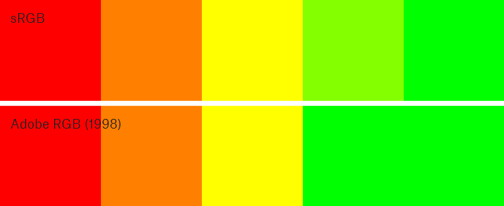

## 颜色模型及颜色空间

上一章回顾了历史上色彩理论的一些重要发展的同时，本章更深入地研究了当前数字色彩理论的现状。当在编程语言中使用颜色时，人们会遇到相当多的术语来描述颜色在色谱中的位置，这些术语通常可以互换使用。在本章中，我们将研究其中的三个术语—颜色模型、颜色空间和颜色配置文件— 并研究在代码中使用颜色时对这些概念进行正确理解的重要性。

### 颜色模型
要理解事物的本质，创建主题的视觉表示是很有帮助的。事实上，人们经常倾向于这样做，从在课堂上乱写笔记，到绘制图表和地图来解释特定的数据集。我们这么做是因为我们很多人都是视觉学习者，看到的东西和听到的东西是不同的。纵观历史，艺术家和科学家们用各种不同的模型来描绘色谱，目的是将色谱的抽象概念转化为可理解的东西。

颜色模型是将色谱描述为多维模型的可视化。大多数现代颜色模型都有3个维度(如RGB)，因此可以被描述为3D形状，而其他模型有更多维度(如CMYK)。接下来，我们将研究RGB、HSV和HSL颜色模型，它们在当前的数字设计工具和编程语言中都很流行。这些颜色模型都使用相同的RGB原色，这使它们成为颜色模型如何在广泛不同的维度上可视化相同颜色光谱的好例子。

***RGB***是一种颜色模型，具有三个维度 - 红色，绿色和蓝色 - 混合以产生特定颜色。 当在这些纬度中定义颜色时，必须知道颜色光谱中的颜色序列，例如， 100％红色和绿色的混合物会产生黄色。 RGB颜色模型通常通过将红色，绿色和蓝色尺寸映射到3D空间中的x，y和z轴上而被描绘为立方体。 这在下面的交互式示例中进行了说明，其中在多维数据集的边界内表示所有可能的颜色混合。

在代码中，用于创建颜色的RGB颜色模型并非最特别直观的模型。 虽然你可以猜测用于某些颜色的值的组合，例如黄色（等量的红色和绿色）或可口可乐瓶上使用的红色（大量的红色和一点点蓝色）， 在这个颜色模型中，纯色更难以猜测。 你会用什么值来表示深紫色？ 如何找到青色的互补色？ 如果找不到答案，那是因为人类不认为颜色是红色，绿色和蓝色光混合而来。

***HSV***是一个圆柱体的颜色模型，它将RGB原色重新映射成更易于人类理解的维度。和蒙塞尔色彩系统一样，这些维度分别是色调、饱和度和值。

- *色调*指定颜色在RGB颜色圆上的角度。0°的色调代表红色，120°代表绿色，240°代表蓝色。
- *饱和度*控制颜色的使用量。一个100%饱和度的颜色将是最纯净的颜色，而0%饱和度产生灰度。
- *值*控制颜色的亮度。亮度为0%的颜色为纯黑色，而亮度为100%的颜色则不掺杂黑色。由于这个维度通常被称为亮度，HSV颜色模型有时被称为HSB，包括在P5.js中。

需要注意的是，HSV颜色模型的三个维度是相互依赖的。如果颜色的值维被设置为0%，色调和饱和度的用量并不重要，因为颜色将是黑色。同样地，如果颜色的饱和度设置为0%，色调并不重要，因为没有使用颜色。因为色调维度是圆形的，所以HSV颜色模型最好以圆柱来体描述。这在下面的交互式示例中进行了说明，其中所有可能的颜色混合都表示在圆柱体的边界内。

***HSL***是另一种与HSV具有两个维度的圆柱形颜色模型，同时用亮度维度替代了值维度。
- *色调*在RGB颜色圆上指定的颜色角度，与HSV完全相同。
- *饱和度*控制颜色的纯度，就像HSV一样。
- *亮度*控制颜色的亮度。这个维度不同于HSV值维度，因为最纯粹的颜色位于标尺的黑白两端之间。0%亮度的颜色是黑色，50%是最纯的颜色，100%是白色。

虽然理论上两种颜色模型的饱和度维度相似(控制使用多少纯色)，但是由于亮度到亮度的重新映射，导致模型之间的饱和度尺度不同。与HSV一样，HSL颜色模型也最好以圆柱来体描述，如下面的交互式示例所示。

在多维空间中，有许多其他的方法可以用来可视化色谱。CMYK颜色模型有四个维度，这意味着必须使用动画或多个3D形状来可视化模型的状态。另一种被称为CIELAB的颜色模型是基于人类感知的拮抗理论建立的，它有两个三维空间，分别代表从红到绿、从黄到蓝的尺度——这是人类无法同时感知的两对互补色。

### 颜色空间

颜色模型提供了一种很好的方法来将色谱可视化，但当它们在计算机屏幕上用来定义和展示颜色的时候是不够的。为了解释这点，让我们假设你拥有一台笔记本电脑，以及一个用于家庭办公的更大的外置屏幕。现在，让我们也假设你在运行P5.js草图在两个屏幕上来展示黄色椭圆。在没有色彩空间的环境下，这两个屏幕将打开它们的红色和绿色子像素就完了。但是，如果你更大的屏幕上装有更昂贵的灯管，这和你的笔记本电脑屏幕的光管看起来大不相同怎么办？这将产生两种截然不同的黄色。这就是颜色空间要解决的问题。


这个色度图是由国际照明委员会(CIE)创建的。它基于20世纪30年代对人类进行的一系列视觉实验，准确地定义了颜色的波长与人眼感知效果之间的关系。这个图——也是一个称为CIEXYZ的颜色空间——非常重要，因为所有现代颜色空间都定义了与这个颜色空间相关的颜色的绝对范围(称为色域)。曲线形状内的两个三角形表示两个流行颜色空间的色域:sRGB和Adobe RGB(1998)。每个三角形的角定义了每个色域的原色，你可能会注意到，虽然这两个颜色空间共享相同的红色和蓝色原色，但这两个颜色空间之间的绿色原色是不同的。换句话说，原色只有在涉及到特定的颜色空间时才具有绝对意义。在上面的示例中，颜色空间允许您的两台计算机显示器通过以下标准过程显示相同的黄色:首先，它将黄色从P5草图的颜色空间转换为CIEXYZ颜色空间(也称为参考颜色空间)。然后，因为每个监视器都知道与CIEXYZ颜色空间相关的主灯光的确切颜色，所以它可以确定要混合的主灯光的数量。

sRGB颜色空间的色域是两个颜色空间中最小的，这意味着它覆盖的颜色范围最小。它是为电脑显示器而设计的，较小的色域反映了大多数高清电视和电脑显示器中主光源的确切颜色。这也意味着sRGB的颜色空间很容易适配硬件厂商，这就是为什么它能成为数字文件使用最广泛的颜色空间的原因。当你在网站上看到一种颜色或图片时，它很可能是sRGB颜色。尽管sRGB对于屏幕上显示的颜色范围来说是一个很好的颜色空间，但是色域不够宽，无法支持用墨水打印的颜色——尤其是在光谱的蓝绿色部分。Adobe RGB(1998)颜色空间有一个更广泛的RGB色域，它被精心选择来覆盖CMYK打印机可以产生的大多数颜色。这还意味着，一组特定的颜色可能看起来非常不同，这取决于它所依附的颜色空间，如下面的示例所示，该示例在两个颜色空间中显示了相同的RGB值。注意最后两个绿色在Adobe RGB(1998)颜色空间中看起来是如何相同的，因为大多数屏幕不能显示更宽颜色范围的绿色主色。



值得注意的是，尽管颜色模型是抽象的数学概念，但如果没有伴随的颜色空间，则无法可视化颜色模型。 上面的RGB，HSV和HSL颜色模型示例都在sRGB颜色空间内可视化，因为这是互联网的默认颜色空间。

颜色配置文件
通过在其元数据中嵌入颜色配置文件，数字图像可以指定特定颜色空间。这告诉任何想要读取图像的程序，像素值是根据特定的颜色空间声明的，没有颜色配置文件的图像通常假定为sRGB。颜色配置文件对于在多个设备上正确再现相同颜色很重要，你经常会看到专业打印服务要求为图像文件设置特定颜色空间（很可能是Adobe RGB（1998）或ProPhoto RGB，一个带有非常宽的色域的颜色空间）。这可以确保图像中的颜色不会被解释为错误的颜色空间。如果您曾经将图像粘贴到现有的Photoshop项目中，结果却发现颜色看起来不对，那么你就是这个问题的受害人。例如，如果将带有Adobe RGB（1998）配置文件的图像粘贴到带有sRGB配置文件的Photoshop文件中，Photoshop会将像素值按较小的色域来解释，从而改变被粘贴图像的颜色。因此，大多数数字设计工具都有内置命令来在颜色空间之间进行转换，而实际上Photoshop在重新解释颜色配置文件之前就很好地提醒了用户。颜色空间之间的转换对于希望用代码设计打印产品的设计师来说尤其有益，因为他们的数字资产在打印之前需要从sRGB转换为打印特定的颜色配置文件。


如果数字图像使用具有广泛色域的颜色配置文件，那么几乎在大多数屏幕上肯定会丢失颜色，因为大多数屏幕只能显示sRGB色域内的颜色。然而，许多较新的屏幕支持更宽的色域。苹果iMac视网膜屏幕使用了一个名为DCI-P3的RGB颜色空间，其色域与Adobe RGB(1998)大致相同，但它包含更多的红黄颜色，不包括一些绿蓝颜色。为了突出颜色管理的复杂性，在视网膜计算机上运行的一些浏览器可能会使没有颜色配置文件的sRGB图像的颜色饱和度更高，而其他浏览器会正确地将sRGB像素值转换为DCI-P3。虽然本书不会深入探讨色彩管理方面的复杂性，但对于感兴趣的读者来说，这里有很多很好的[参考资料](https://abookapart.com/products/making-sense-of-color-management)。

P5.js的颜色
作为一个基于浏览器的JavaScript库，P5.js中的所有颜色值都遵循sRGB (互联网标准的颜色空间)。您可以在上述三个颜色模型中定义这些颜色:RGB、HSV(称为HSB)和HSL。在P5.js中，绘制颜色形状的主要方法是将颜色值传递给fill()和stroke()函数。这将为所有后续形状设置当前填充和描边颜色，在再次fill()或stroke()、禁用描边或完全使用noStroke()或noFill()函数填充之前，将沿用该设置。

RGB是P5.js中默认的颜色模型，这意味着fill()和strokte()函数需要三个0-255的数字作为参数，来表达该颜色中红色、绿色、蓝色的用量。这个特定范围背后的原因是最多256个值可以存储在一个字节(8位)中，允许每种RGB颜色只占用24位。尽管256种不同的红、绿、蓝颜色听起来并不多，但它们可以产生16,777,216种不同的颜色，这实际上比人眼所能感知的要多得多。

``` javascript
noStroke();
fill(210, 70, 50);
ellipse(150, height/2, 200, 200);

fill(245, 225, 50);
ellipse(300, height/2, 200, 200);

fill(50, 120, 170);
ellipse(450, height/2, 200, 200);
```

<!-- 等待插入代码 -->


 P5.js还允许使用web设计中十六进制语法来指定RGB颜色模型中的颜色。十六进制语法不是使用三个数字，而是使用一个#符号和一个六个字符的字符串来表示颜色值。每个主色在这个字符串中都有两个字符，使用数字0-9表示0到9，字母A-F表示10到15。每个字符有16种变体，因此每个主颜色可以在两个字符中指定0到255之间的值。

 ``` javascript
noStroke();
fill("#d24632");
ellipse(150, height/2, 200, 200);

fill("#f5e132");
ellipse(300, height/2, 200, 200);

fill("#3278aa");
ellipse(450, height/2, 200, 200);
```

<!-- 等待插入代码 -->

P5.js中的colorMode()函数可用于切换到另一个颜色模型，这意味着fill()和stroke()函数将根据新颜色模型的维度来得出颜色范围。HSV(在P5.js中称为HSB)和HSL的默认数值范围是用0-360表示色调(表示角度)，0-100表示饱和度和亮度/亮度(表示百分比)。下面的代码示例同时使用HSV和HSL颜色模型来绘制三个圆。

 ``` javascript
noStroke();
colorMode(HSB);
fill(7, 76, 82);
ellipse(150, height/2, 200, 200);

fill(54, 80, 96);
ellipse(300, height/2, 200, 200);

colorMode(HSL);
fill(205, 55, 42);
ellipse(450, height/2, 200, 200);
```

也可以更改每种颜色模型的默认数值范围。 这可以通过在调用colorMode（）函数时传入三个附加数字来完成，如下所示，其中HSV颜色模型的所有三个维度的范围都设置为0-1。


 ``` javascript
noStroke();
colorMode(HSB, 1, 1, 1);
fill(0.0195, 0.76, 0.82);
ellipse(150, height/2, 200, 200);

fill(0.15, 0.80, 0.96);
ellipse(300, height/2, 200, 200);

fill(0.569, 0.71, 0.67);
ellipse(450, height/2, 200, 200);
```

在接下来的章节中，我们将研究在P5.js中以编程方式组合颜色的一系列不同技术。这些示例中有许多将使用HSL颜色模型，因为它是一种直观的浏览色谱的方法。

