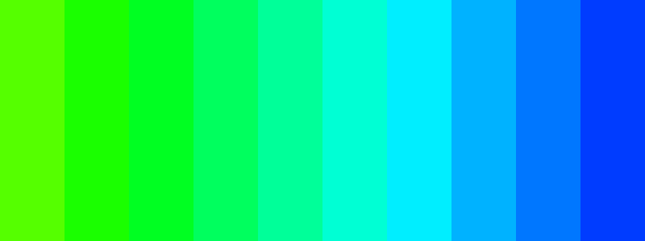
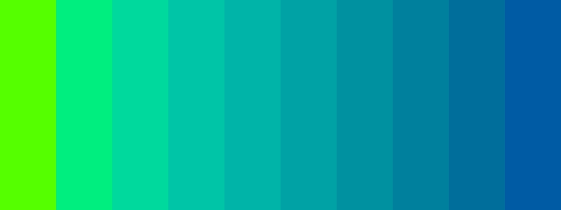
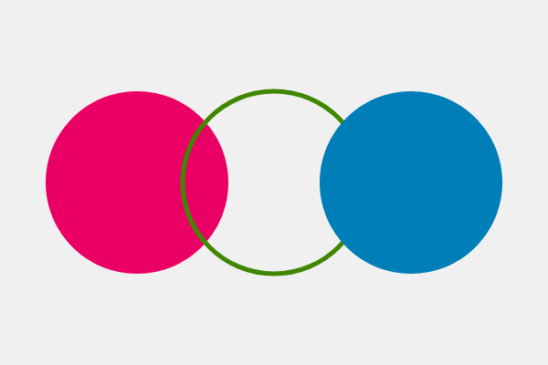
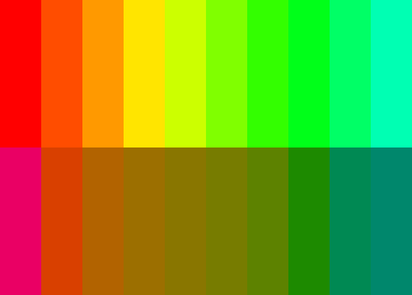
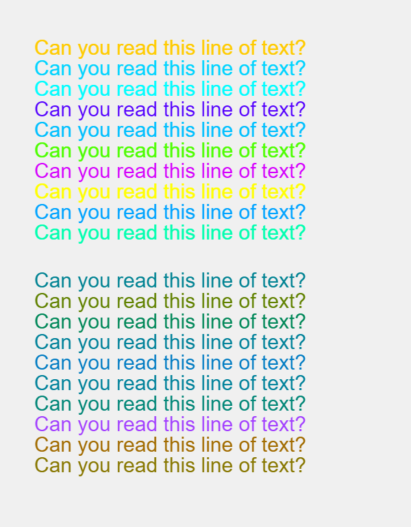

## 感知一致的颜色空间

> 在视觉感知中，颜色几乎从未被看到，因为它实际上就是它。 这一事实使得色彩成为艺术中最相对的媒介。约瑟夫·阿尔伯斯(1963)，《颜色的相互作用》

如果你召集一群平面设计师，让他们定义感知一致的颜色空间概念，他们很有可能都不知道该说什么。从表面上看，感知一致性是很容易解释的:这些颜色空间是相对于sRGB等颜色空间的人性化替代品，它们对于使用代码的设计师非常有用。尽管如此，他们在程序设计中使用起来仍然令人畏惧。感知上一致的颜色空间根植于科学的颜色理论，而这个社区几乎没有做什么来让它们更容易被更多的观众所接受。在本章中，我们将研究感知一致颜色空间的概念，并回答一些与之相关的常见问题:它们是什么?我们为什么需要他们?我们如何在代码中使用它们?

### sRGB有什么问题？
让我们假设您想设计一个海报，其中十个正方形的颜色从绿色到蓝色以相同的步骤变化。你可能会说，*"简单"*，然后快速地编写代码，在每个矩形之间创建相同的色调变化。确信将是一个漂亮的渐变，在运行代码后，您会惊讶地看到以下运行结果。



你可能会注意到这个带颜色的长方形有点奇怪。虽然颜色从绿色到蓝色变化，但它们在末端的变化似乎更多。绿色看起来几乎一样，而蓝色则更加多样化。它在颜色的亮度上也有很多变化，中间的青色看起来比蓝色更亮。这是因为默认的sRGB颜色空间(以及在其上构建的任何颜色模型，如HSV和HSL)是不规则的，这意味着即使矩形具有均匀间隔的色调值，对应的效果对人眼来说也是非线性的。


为了解释原因，我们需要看看上一章简要讨论过的色度图。这张图是20世纪30年代大量科学实验的结果，它把可见的光谱基于人类视觉的尺度来绘制。第一件你可能注意到的事是在这个图中有很多绿色。色谱边缘显示的蓝色数字表示对应颜色的波长，你会注意到从520nm到560nm的颜色都是绿色的。但是如果你取另一个40nm范围，例如460nm到500nm，它包含了更广泛的蓝色、青色和绿色。这就解释了为什么我们上面的设计中大部分矩形是绿色的，以及为什么我们看到在天平的末端突然转向蓝色:在色调中线性移动会让眼睛看起来不协调。如果我们想要处理与人类视觉相关的颜色，我们需要在这些人类测量的基础上建立一个颜色空间，这就是感知上一致的颜色空间。


下面的矩形在色调上是均匀分布的，但这一次的颜色是使用感知上一致的颜色空间来创建的。请注意这些颜色的明度是如何保持不变的，并且这些色调是均匀分布的，从而形成一个线性的颜色渐变。


为什么我们需要感知一致的颜色空间?因为在代码中使用颜色与在传统设计工具中不同。传统的工具鼓励设计师在手工工作流程中使用颜色选择器作为选择颜色组合的主要方式。在这个场景中，设计师使用他们的眼睛来判断颜色的对错，而RGB值在这个决策中不起作用。代码则不同，因为编程语言鼓励设计人员将颜色看作所选颜色模型中的数字或位置。如果数字与输出不一致，则很难学习这种技能。感知上一致的颜色空间能使我们将代码中的数字与查看器中感知到的视觉效果对齐。

在某些情况下，感知一致性是必不可少的。举一个简单的例子，就像很困难在不规则的颜色空间里选择一种易于在黑色背景下阅读的随机颜色。因为具有形同亮度或亮度的颜色在其出现的亮度上有很大差别。（蓝色和黄色在HSV中都有100%的亮度，但蓝色比黄色暗得多）人们需要根据所选的色调进行各种计算，才能使随机的颜色同样明亮。

如果设计师没有意识到这一点，甚至会导致误导性的设计。一个很好的例子是在数据可视化中使用连续色阶。对于某些地图类型，设计人员使用渐变色来给地理区域上色，以反映数据点的值，用户可以比较区域之间的颜色来获得数据的感觉。如果设计师在常规颜色空间中创建了颜色比例，则感知的颜色将不同于颜色值中反映的数据点。为了让设计显示实际数据，需要一个感知均匀的颜色空间。

### 一种更好的解决方案
国际照明委员会（CIE）在20世纪30年代创建了上述色度图来解决这个问题。实际上是一个名为CIEXYZ的颜色空间的2D视图，在1970年代被稍微改进的CIELUV和CIELAB颜色空间取代。很难描述这些颜色空间是如何工作的而不涉及到基本的数学，但是它们通常允许你指定颜色，不是在混合光中，而是在与人类视觉更相关的维度中，他们做复杂的颜色变换，以确保这些维度反映出人类视觉是如何工作的。例如，CIELUV颜色空间有两个维度u和v，表示从红色到绿色和黄色到蓝色的颜色比例。要在CIELUV颜色空间中创建颜色，必须定义颜色的亮度（l），它是红色还是绿色（u），以及它是黄色还是蓝色（v）。类似地，人类通过反过程模型计算来自我们视网膜锥细胞的信号，这使得我们无法看到红绿色或黄蓝色。

尽管这些颜色空间是基于人类的感知的，但它们在使用代码中并不直观。像RGB颜色空间一样，很难猜出创建暗紫色或亮青色所需的LUV值。值得庆幸的是，感知一致的颜色空间也可以在不同的颜色模型中重新映射它们的维度，因此设计师可以使用更直观的维度，同时保持感知一致性。

### HSLuv
[HSLuv项目](http://www.hsluv.org/)是最近试图使这些颜色空间更直观的尝试之一。它允许你使用与HSL颜色模型相同维度的CIELUV颜色空间。被称为人类友好的HSL，最初的代码是用编程语言Haxe编写的，但是现在这个项目被大多数流行的编程语言实现，包括JavaScript。

在深入研究代码细节之前，了解HSLuv与HSL之间的差异非常重要。HSLuv允许您基于三维(色调、饱和度和亮度)定义颜色，但是与基于sRGB的HSL颜色模型相反，具有相同维度值的颜色保证看起来相似。亮度值相同的两种颜色看起来同样明亮，饱和度相同的两种颜色感知到的颜色纯度相同。和HSL一样，饱和度和亮度维度也表示为0到100之间的百分比，但在HSLuv中，这些百分比反映了感知到的颜色混合。亮度为50的灰色保证是中灰色。

尽管HSLuv不是一个内置的颜色模式，但它与P5.js配合得非常好。要使用这个库，首先需要下载最新版本的[HSLuv](https://github.com/hsluv/hsluv/releases)，然后在HTML文件中包含这个库文件。这使得HSLuv颜色转换函数可以在你的sketch中访问。

``` javascript
  <script src="p5.min.js" type="text/javascript"></script>
  <script src="hsluv.min.js"  type="text/javascript"></script>
```

每个HSLuv的实现都包含四个函数，可以用来在HSLuv和RGB之间进行转换。我们可以使用其中一个函数—`hsluvToRgb()`—将HSLuv颜色值转换为`fill()`和`stroke()`函数可以理解的RGB值。`hsluvToRgb()`函数期望一个包含三个值的数组——所需的色调、饱和度和颜色的亮度——并返回另一个RGB值在`0`到`1`之间的数组。因为P5.js期望RGB的值在0到255之间，所以我们需要将数组值相乘来放大它们。这可以归结为两行代码，如下面的示例所示。

```javascript
// First convert the HSLuv values to a RGB array
var rgb = hsluv.hsluvToRgb([0, 50, 50]);

// Then use the RGB values in a scale of 0-255
fill(rgb[0] * 255, rgb[1] * 255, rgb[2] * 255);
```

这意味着每次必须为`fill()`或`stroke()`函数创建感知上一致的颜色时，都需要额外的一行代码来处理HSLuv到RGB的转换。可以通过创建封装这两行代码的小助手函数来避免这种情况。
```javascript
function fillHsluv(h, s, l) {
  var rgb = hsluv.hsluvToRgb([h, s, l]);
  fill(rgb[0] * 255, rgb[1] * 255, rgb[2] * 255);
}

function strokeHsluv(h, s, l) {
  var rgb = hsluv.hsluvToRgb([h, s, l]);
  stroke(rgb[0] * 255, rgb[1] * 255, rgb[2] * 255);
}
```
现在可以使用这两个函数来代替内置的填充和描边函数。本质上是在P5.js中创建自己的colorMode的方法来替代原先的实现。下面是一个如何使用它们的快速示例。

```javascript
function fillHsluv(h, s, l) {
  var rgb = hsluv.hsluvToRgb([h, s, l]);
  fill(rgb[0] * 255, rgb[1] * 255, rgb[2] * 255);
}

function strokeHsluv(h, s, l) {
  noStroke();
  fillHsluv(0, 100, 50);
  ellipse(150, height/2, 200, 200);

  noFill();
  strokeWeight(5);
  strokeHsluv(120, 100, 50);
  ellipse(300, height/2, 200, 200);

  noStroke();
  fillHsluv(240, 100, 50);
  ellipse(450, height/2, 200, 200);
}
```

现在我们具备在P5.js中使用感知上一致的颜色空间的能力，我们可以从本章开始重复矩形渐变实验。下面的示例使用相同的颜色值，使用HSL和HSLuv绘制矩形条。注意后一个例子中的颜色看起来具有同样明亮。

```javascript
var w = width / 10;

colorMode(HSL);
for(var i = 0; i < numRects; i++) {
  fill(i * 18, 100, 50);
  rect(i * w, 0, w, height/2);
}

colorMode(RGB);
translate(0, height/2);
for(var i = 0; i < numRects; i++) {
  fillHsluv(i * 18, 100, 50);
  rect(i * w, 0, w, height/2);
}
```



我们还可以使用这些新函数来选择针对特定背景颜色可读的随机颜色。下面的示例显示了一行使用HSL和HSLuv以随机颜色显示的文本。注意第一个例子，有时使用非常明亮的黄色，即使亮度是恒定的。后一个使用感知上一致的颜色空间的例子则没有这个问题。

```javascript
var fontSize = 30;
textSize(fontSize);

translate(50, 50 + fontSize);
colorMode(HSL);
for(var i = 0; i < 10; i++) {
  fill(random(360), 100, 50);
  text("Can you read this line of text?", 0, i * fontSize);
}

colorMode(RGB);
translate(0, 340);
for(var i = 0; i < 10; i++) {
  fillHsluv(random(360), 100, 50);
  text("Can you read this line of text?", 0, i * fontSize);
}
```


尽管P5.js并不理解感知一致颜色空间的概念，但本章演示了如何使用HSLuv JavaScript库将感知一致的颜色空间转换为P5.js所用的sRGB颜色空间。在接下来的章节中，我们将使用这种技术以程序方式生成配色方案，并在P5.js中使用它们来创建动态设计。